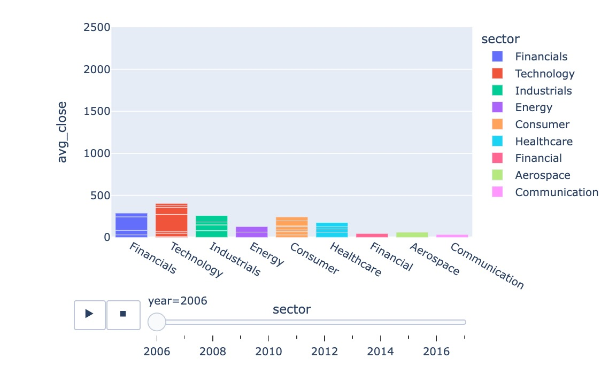

# ANIMATION

## Why use animation in a chart?

Using animation provides a number of benefits when telling a story with data. 

- User Engagement
- Simplify Complex Narratives
- Improve Understanding of Change Over Time
- Make Insights more Memorable

When users initiate an animation their attention is focused. It is especially useful
for showing change over time.

## Chart Description

The data for the animation visualization provided here, contains average closing prices for stock in a 
variety of sectors over a period of 11 years.  The underlying chart is a stacked bar chart
that plots stock sector against the average closing price of a stock (y axis). The stacked bar 
is composed of individual stocks in the sector.  Over time, these individual stocks change
value and the size of the stock closing price changes within a bar.  The user starts and stops the 
animation by pressing buttons underneath the chart.



## Data

There are two dataset that are merged using Pandas to create the data the makes up the animated chart:
`/data/stock_sector_company.csv` and `/data/all_stocks_2006-01-01_to_2018-01-01.csv`.  

### Sample Data for stock_sector_company.csv
```
stock,sector,company
MMM,Industrials,3M Company
MRK,Healthcare,Merck & Co. Inc.
MSFT,Technology,Microsoft Corporation
...
```

### Sample Data for all_stocks 2006-01-01_to_2018-01-01.csv

```
Date,Open,High,Low,Close,Volume,Name
2006-01-03,77.76,79.35,77.24,79.11,3117200,MMM
2006-01-04,79.49,79.49,78.25,78.71,2558000,MMM
2006-01-05,78.41,78.65,77.56,77.99,2529500,MMM
...
```
The data is joined in Pandaas using `stock` from `stock_sector_company` and `Name` from. 
`Sample Data for all_stocks 2006-01-01_to_2018-01-01.csv`.  

```python
df_merged = pd.merge(df_stocks, df_sectors, left_on='Name', right_on='stock', how='left')
```
## Data Exploration

Data Exploration is an important part of analysis.  You'll find the files with code for animation data in `./ANIMATION/explore_data`.  

### Stock Price Data (all_stocks_2006_01_01_to_2018_01_01)

This data has a lot of numerical values. The items that are analyzed are:

- Check for empty file.
- View Ranges of Years.
- View DataFrame information with the `.info` function: summarizes data showing data types and memory usage.
- Look for missing data which often appears as `NAN`, null, or 0 using a function call like this: 
`df_historical_stock.isnull().sum()`. If data is missing plan to acknowlege that or set the missing data to values 
like mean or mode.
- Create line charts of data to visually see what trends the data exibits and determine if they match expectation.

### Stock Sector Data (stock_sector_company)

This data has no numerical values.  The items analyzed are:

- Check for empty file.
- Check for missing data.
- View raw data by finding the number of stocks and using `.sample` to see the list and sort it by company.
- View column names

When Data Exploration is complete, you can move on to creating visualizations with the data.

## Data Visualization

See [Stock price by sector over time animation](https://github.com/rebeccapeltz/data_analysis_code/blob/main/ANIMATION/animated_bar_chart_avg_close_by_sector.ipynb) for code to complete animation.

The steps to coding the animation are: 

1.  Import plotly.express, pandas and os
2.  Create and output HTML file name to make your visualization accessible on the web.
3.  Create DataFrames by reading in the CSV data for stock prices and stock sectors.
4.  Create a `year` column using Datetime to convert a string to a DateTime values and then extract the year.
5.  Merge the stock prices and stock sector data to create a new DataFrame with data from both files.
6.  Group merged values by year, stock, sector, company and get averages.
7.  Rename the columns now that they hold averages.
8.  Create a Ploly Stacked Bar chart with x-axis as the sector and y-axis as the average closing price.
9.  Make the Stacked Bar chart animated by including options for animation frame and animation group.
10. Set a range for the y axis min and max.
11. Set names for hover values on the stacked bar chart.
12. Set the update layout transition time to control how long the full animation takes.