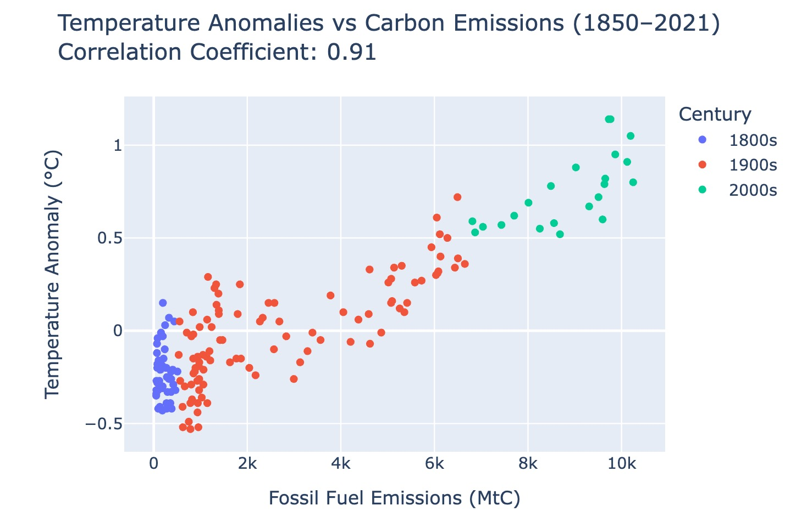
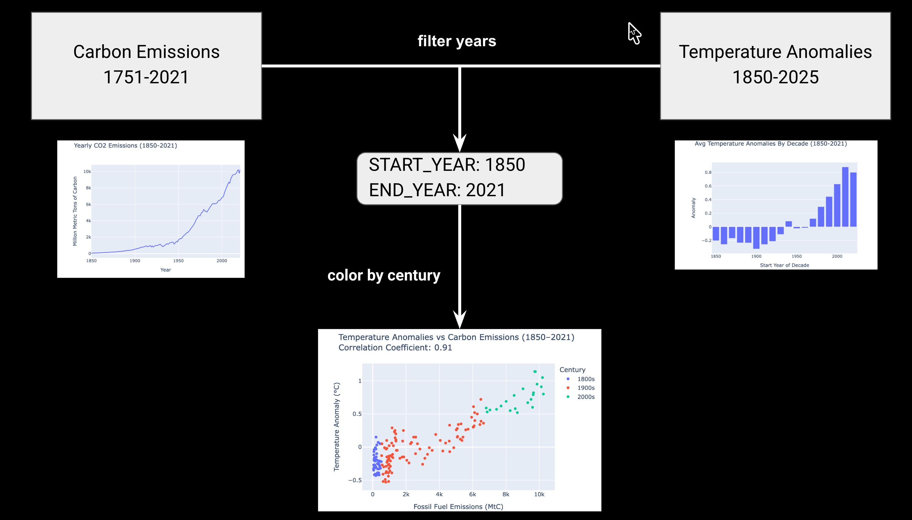
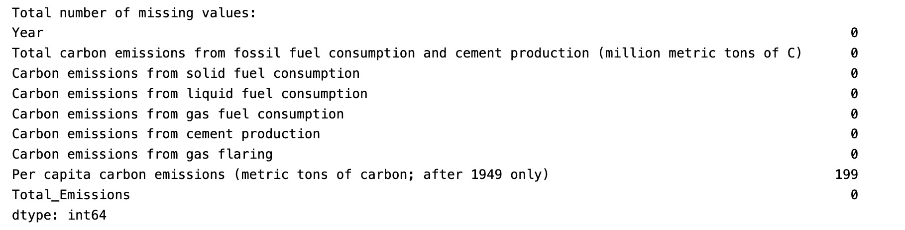
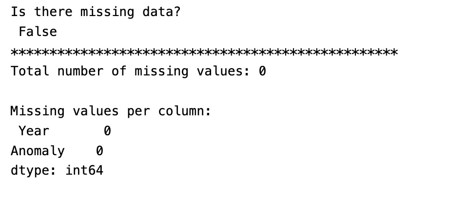

# CORRELATION

## What is correlation and what does it tell the user?

Correlation is a measure of how two variables move together:

- Positive: if one increases the other tends to increase. Example: `sales` and `profit`.
- Negative: if one increases the other decreases. Example: `temperature outside` and `cost of heating inside`.
- No Correlation: no relationship between changes in one and change in another. Example: `shoe size` and `intelligence`.

Correlation is not **Causation**  - it’s **Association**.

Determining Causation requires more statistical analysis such as A/B testing.

The **Coefficient of Correlation** is a calculated value the describes the association:
- +1 perfect positive meaning that when one variable's value increases the other increases
-  0 no meaning linear relationship meaning 
- -1 perfect negative meaning that when one variable's increases the other decreases


Causation: drowning deaths and ice cream sales → caused by heat wave


## Chart Description

The data for the correlation visualization provided here, uses two datasets: CO2_emissions.csv and global_temp_anomaly.csv. The CO2 emissions data comes from Plotly ([Figure Friday CO2 Emissions](https://raw.githubusercontent.com/plotly/Figure-Friday/refs/heads/main/2025/week-21/global.1751_2021.csv)) and the Global Temperature Anomolies data comes from [National Oceanic and Atmospheric Administration (NOAA)](https://psl.noaa.gov/data/gridded/data.noaaglobaltemp.html). The code for this 
project provides visualizations that show the data trends for each data set using lines and bars. The two datasets are not merged until they are set up for a scatter plot. Instead they are each filtered to so that they can be compared by date.  The matching date range
allows for the computation of the Coefficient of Corrleation, which turns out to be a posiive +0.91.  

Finally the two dataset values for C02 Emissions and Temperature Anomolies are plotted against each in a Scatter Plot that shows the positive relationsip.  Finally, color is apply to the Scatter Plot points so that the viewer can
identify the change by Century.




## Data

There are two dataset that are merged using Pandas to create the data the makes up the animated chart:
`/data/global_temp_anomaly.csv` and `/data/c02_emissions.csv`.  

### Sample Data for global_temp_anomaly.csv
```
Year,Anomaly
1850,-0.35
1851,-0.34
1852,-0.32
...
```

### Sample Data for cO2_emissions.csv

```
Year,Total carbon emissions from fossil fuel consumption and cement production (million metric tons of C),Carbon emissions from solid fuel consumption,Carbon emissions from liquid fuel consumption,Carbon emissions from gas fuel consumption,Carbon emissions from cement production,Carbon emissions from gas flaring,Per capita carbon emissions (metric tons of carbon; after 1949 only)
1751,3,3,0,0,0,0,
1752,3,3,0,0,0,0,
1753,3,3,0,0,0,0,
...
```
You can see in the sample data above the the two datasets don't start in the same year. Through data exploration below, you'll also find that they don't end in 
the same year.  In order to compare them, they need to be filterned.

## Data Exploration

Data Exploration is an important part of analysis.  You'll find the files with code for animation data in `./CORRELATION/explore_data`.  

In order to compare CO2 Emissions to Temperature Anomalies, the two datasets must match in years. Carbon Emissions data was gathered from 1751 to 2021.  Temperature Anomalies data was gathered from 
1850 to 2025.  The image below shows how we need to filter the data for each to include the years 1850 through 2021.   




### CO2 Emissions (cO2_emissions.csv)

This data has a lot of numerical values. The items that are analyzed are:

- Check for empty file.
- View Ranges of Years.
- View DataFrame information with the `.info` function: summarizes data showing data types and memory usage.
- View Line chart of emissions over time
- Look for missing data which often appears as `NAN`, null, 0, or empty space using a function call like this: 
`total_missing = df_emissions.isnull().sum()`
We can also look for missing columns like this: 
`missing_per_column = df_emissions.isnull().sum().sum()`

We can see that there are 199 rows missing data in `Per capita carbon emissions(metric tons of carbon;after 1949 only)`.  This won't be a problem for this data because we are just using the fields `Year` and `Total carbon emissions from fossil fuel consumption and cement production (million metric tons of C)` to create a line chart.



We also look at total missing values per column of 199.  This is not a concern either, because that reflects the missing data for the data that didn't start getting collected until 1949.

### Temperature Anomolies ()

This data has a lot of numerical values. The items that are analyzed are:

- Check for empty file.
- View Ranges of Years.
- View DataFrame information with the `.info` function: summarizes data showing data types and memory usage.
- View Line chart of temperature anomolies over time
- Look for missing data which often appears as `NAN`, null, 0, or empty space using a function call 

No missing data:




## Data Visualization

See [CO2 Emissions correlated with Temperature Anomolies](https://github.com/rebeccapeltz/data_analysis_code/blob/main/CORRELATION/correlating_emissions_and_temp_anomalies.ipynb) for code 
that demonstrates correlating two datasets.

The steps to coding the animation are: 

1.  Import plotly.express, pandas and os
2.  Create and output HTML files names to make your visualizations accessible on the web. There are three visualizations associated with this project: line chart for Carbon Emissions, bar chart for Temperature Anomolies, and scatter chart for comparing C02 Emissions to Temperature Anomolies over time.
3.  Create DataFrames by reading in the CSV data for C02 Emissions and Temperature Anomolies and filter
so that both are using data between 1850 and 2021.
4.  Create a line chart for Carbon Emissions.
5.  Create a bar chart for Temperature Anonmlies.  In order to create a bar chart, the data must be "binned".  The binning process involves creating new columns in the dataframe to represent 10 years
worth of data.  Next, the Pands `.cut` function is called to load the bins with the mean for the 10 yar
period. A 'Year_bin' column is created and the `.reset_index` function is called to rename the indexes after adding the bins.  Finally the command below extracts the starting year of each decade from the interval.   
`grouped['Year_bin_start'] = grouped['Year_bin'].apply(lambda x: int(x.left))`  
Binning is a technique used to create chunks of data that hold a value like mean, mode, or median.  
6.  In the final chart, a scatter plot is created with CO2 emissions on the x-axis and temperature anomolies on the y-axis.
In order to create the scatter plot the two datasets are merged by joining them at the [Year] column.  A column called `Century` is set up and calculated from the years.  
```
# Get list of years from merged
df_years = df_merged[['Year']].copy()

# Add century to df merged
# Use integer division (//) to 
df_merged['Century'] = ((df_merged['Year'] // 100) * 100).astype(str) + 's'
```

7. A Coefficient of Correlation is calculated using Pandas `.corr` function.  

```
coefficient_of_correlation = \
    df_filtered_emissions_1850_2021[LINE_Y_COL_NAME]\
        .corr(df_filtered_temp_anomalies_1850_2021[ANOMALY_COL_NAME])
```
8. Finally a scatter plot is created using 'Fossil Fuel Emissions' on the x-axis and `Anomoly` on the y-axis.
9. The title of the scatter plot includes the Coefficient of Correlation.

 