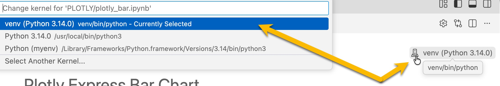
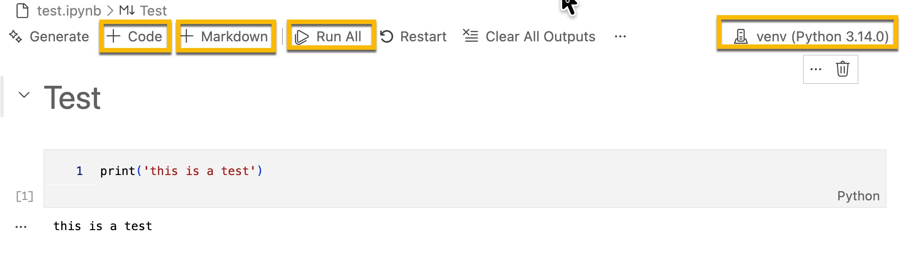
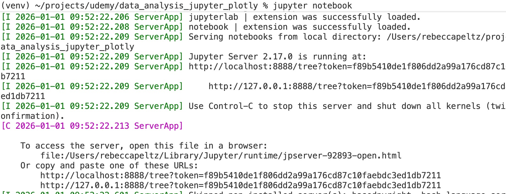
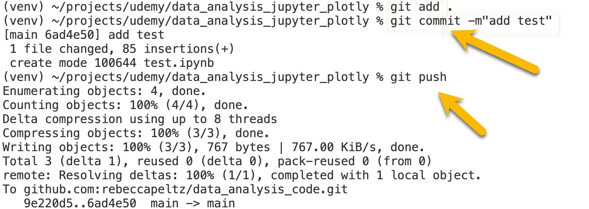
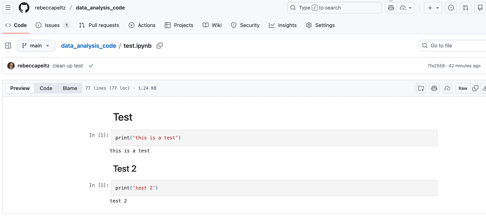

# Host Jupyter Notebooks

- IDE's like VS Code (Visual Studio Code) and Pycharm provide a way for you to run Python code in your Jupyter Notebook locally. You need to install `ipykernel` for this functionality.

- Once you've installed the Python `Jupyter` package you can start a server by executing `jupyter notebook` from the command line.

- You can upload your Jupyter Notebooks to GitHub.  GitHub will render a static web page showing your Notebooks Markdown and code.

## Interacting with Jupyter Notebooks

Jupyter Notebooks are like research tools.  They provide a place to document and a place to experiment.  You write **Markdown** to document and **Code** to experiment. You can add markdown and code in your IDE or your local server.  The interface for adding markdown in code varies.  Explore the interface and look for how to add code and markdown.  Look at ways to move the chunks of markdown and code up and down within the page.

## Local Hosting: IDE File

To use the local hosting in the file system, install the `ipykernel`.

```bash
pip install ipykernel
```
The image below shows an installed and selected `ipykernel` on the far right.  Once you've setup your virutal environment and installed `ipykernel`, you can click on icon on the right and select your `venv` to integrate with Python.






## Local Hosting: Jupyter Server

You can run a local server that hosts your local Jupyter Notebooks after installing the `jupyter` package.

```bash
pip install jupyter
```

Open the server by running this command from the command line:

```bash
jupyter notebook
```



Any changes you make on the server will be saved to the local file.

## GitHub Hosting

Upload your Jupyter Notebook to GitHub using `git` commands from the command line or go to GitHub and manually upload and commit files to GitHub.

### GitHub Command Line


### GitHub Add File Online


### GitHub Static Hosting
